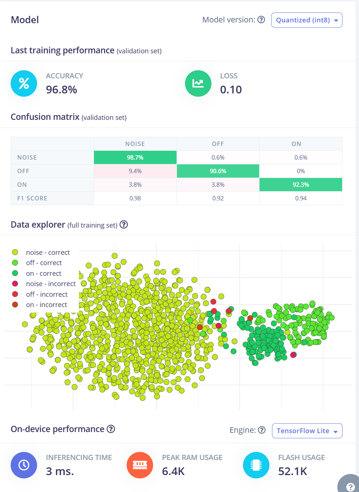

# Connect to your light

Author: Xueli Jiao
 
Link to github repo: https://github.com/pumpkins628/Connect_to_your_light
 
Link to Edge Impulse projects: https://studio.edgeimpulse.com/studio/363562
 
Link to introduction video: https://youtu.be/nAzViRKGrvE?si=0OkuovE1TI8DHduY

## Introduction
### Overview of the project
This project is a smart voice control system designed to control the home lighting system using simple voice commands. This project uses the Edge Impulse and the Arduino Nano 33 BLE, which, combined with the microphone module, can receive and process specific voice commands to control the switching of LED lights. The system simulates a real-life light control scenario, with the command "Hiya, light" to turn the lights on and "Goodbye, light" to turn them off. At present, only LED is used to simulate the project, and the final accuracy rate is about 95%, which can be connected with home lights to realize the practical application of voice control technology in the field of smart homes.
### Inspiration
I know many families have no reasonable circuit design planning, resulting in many inconveniences to life later. For example, in my home the switch of the bedroom light is at the door, if you want to turn off the light before going to bed at night, you need to go there and turn it off, if it is in the cold winter, this feeling must be horrible. Inspired by this situation and deep learning lessons, I wanted to make such a system to control the lights in the home or other cases you want.
### Examples that it is based on. 
This project is based on what the professor showed us in the lecture: using your voice to control the light on the Arduino Nano. I also searched for information about connecting other parts via Arduino Nano in deep learning. In this case, I tried to use an LED to simulate reality.

## Research Question
With the development of smart home technology, automated control systems are becoming increasingly common in daily life. Can we use deep learning to control the switch of lights in the home by using sound to improve the convenience of people's lives?

## Application Overview
This application can be divided into four main stages.

- Sound Collection: First, environment sounds are collected by the built-in microphone module on the Arduino Nano 33 BLE (At the training model stage, using an iPhone that can connect with the Edge Impulse). I categorize the sounds into three types: "Hiya, light", "Goodbye, light", and other noises.
- Model Training: The collected voice data is processed using the Edge Impulse platform. On this platform, I adjusted different processing blocks, learning blocks, parameters, and neural network architectures
. Through multiple experiments, I tried to search for the optimal model suitable for controlling the light switch.
- Model Deployment: The trained model is deployed to the Arduino Nano 33 BLE, and I also added some codes to control the LED light.
- Field Testing: The application is placed in a real-life environment for testing. The LED light turns on when the voice command "Hiya, light" is detected and turns off when "Goodbye, light" is detected.

  

  The whole process of the application

## Data

### Audio resource
I recorded audio samples from different classmates, each manually recording two audio commands: "Hiya, light" and "Goodbye, light." in the lab. I also collected audio data from neighbours and staff in my apartment. These participants come from various countries and have diverse ages, genders, accents, and speaking characteristics, providing a rich data foundation for training the model.
I also got a dataset of noise from the internet; it contains many kinds of noise, such as running water, door closing, restaurant environment, park environment and so on.

### Audio preprocessing

After collecting the data, I uploaded all the recordings to the Edge Impulse for preprocessing. Firstly, I extracted the specific command phrases we needed from the 60-second audio recordings to cut off background noise. And then, I added different labels for each audio to classify and train. Here are some different spectrums for different kinds.

  

 Spectrum of "Hiya, light" 

 

  

 Spectrum of "Goodbye, light" 

 

  
  
  

 Spectrums of different noise 

 

### Dataset

Finally, we have the dataset to train the model. The total duration of the dataset is 25m 30s, in which the training set lasts for 18m 16s, and the test set lasts for 7m14s, with a ratio of about 3:1. This is very reasonable.
|      | Training | Test     | Total    |
|------|----------|----------|----------|
| ON   | 110     | 60     | 170     |
| OFF  | 116     | 51     | 167     |
| Noise| 840     | 308     | 1148     |
| Total| 1066     | 419     | 1485    |

## Model

  

 Workflow

 
As the picture shows, we have three processing blocks and two learning blocks to choose from, which means they can combine six training models. However, Transfer Learning (Keyword Spotting)only works with an Audio (MFE) block; we can use four models to choose from.
 
 

- MFCC: Extracts features from audio signals using Mel Frequency Cepstral Coefficients, great for human voice.
- MFE / Spectrogram: More suitable for non-voice audio.
 
 

Theoretically, our best combination is MFCC and Classification, but based on the rigour of the experiment, I tried different combinations to observe the difference in their accuracy. Should we choose the combination I assumed? It can be seen from the figure that they have similar accuracy and loss; even the best combination is different from what we expected. I further debugged the first three groups to train the best model.

  

 Record of block choice

## Experiments

Based on the abovementioned situation, we perform further tests on the first three combinations. The control variable method was used in all experiments to seek the best parameters of the model. Here is the record of 33 experiments.

  

 Record of experiments

(The parts highlighted in yellow are the best parameter values under the blocks)

### MFCC/Classification
At first, I kept the other parameters unchanged and changed the Dropout to observe the experimental results. The results show that when the Dropout is 0.2, the accuracy of the training model is the highest, and the loss is the smallest. However, when I continued to test, the accuracy of the test set and the accuracy of the training set were relatively large. So, the best value is 0.25. By using the same experimental method, I found the best learning rate and the number of training cycles was 0.005 and 100, respectively. And I also tried to change the neurons. Too many neurons can increase the complexity and training time of the model while also increasing the risk of overfitting. Conversely, too few neurons can cause the model not to capture enough information, reducing accuracy. The project wasn't complicated, so eight neurons were enough to process the incoming data, and increasing it to 16 didn't significantly improve accuracy.

### MFE/Classification
We also take the same operation for combination MFE/Classification and finally get the parameter of the best model trained by this combination as follows.

|  Number of training cycles    | Learning rate | Dropout     | Numbers of neurons   |
|:------:|:----------:|:----------:|:----------:|
|     100  | 0.005     | 0.3    | 16/32     |

### MFE/Transfer Learning(Keyword Spotting)

Since MFE/Transfer Learning(Keyword Spotting) has its neural network architecture, it cannot modify the parameter. I can only change the learning rate and number of training cycles to train models with high accuracy and low loss. Finally, I determined the best values for them, which were 100 and 0.05, respectively.

### Summary

By comparing the above three best models, it is easy to find that combination MFE/Transfer Learning(Keyword Spotting) has a high accuracy of 98.2%, and the loss is also the lowest of 0.06. We know that MFE extracts a spectrogram from audio signals using Mel-filterbank energy features, which is great for non-voice audio. However, the experiment result is inconsistent with the expectation, so I plan to deploy the MFE/Transfer Learning(Keyword Spotting) combination to the Arduino Nano hardware for testing.

However, during the deployment process, a problem occurred, and subsequent operations could not be performed due to insufficient memory. Because the MFE/Transfer Learning(Keyword Spotting) combination input layer has 3960 features, it will consume a lot of memory and cause the above problem. After analysis, I replaced the model with an MFCC/Classification combination with only 650 features. Although its accuracy rate is not as high as the current model, there is only a tiny gap, which does not affect the recognition result. **So, I ended up with the first model, which uses MFCC and Classification block.**

  

 Deployment success

## Results and Observations

### Results

- The accuracy of the trained model is as high as 96.8%, and the loss is 0.1. Even in the test set, it has 95.16% accuracy, which proves that it can make a good judgment of our surrounding environment.
- The confusion matrix shows that the difference between the above three types of sounds is relatively obvious. However, some aliasing is in the middle, not affecting the final training result.

  

 Model final result

### Observations

Although each parameter has a different effect on the final result, a relatively accurate model must be the result of the coordination of the parameters, rather than blindly increasing or decreasing one parameter. (Example as follow)

- While a higher number of training cycles allows the model to be sufficiently trained to achieve higher accuracy, overtraining can also lead to overfitting. Compared with experiments 16, 17, and 18, it can be seen that when other parameters are consistent, the model with training cycle 100 has the highest accuracy, rather than the model with  200, indicating that it has overfitting.
 

The accuracy of the training set is generally higher than that of the test set, which is a normal phenomenon.
 

Affected by different hardware devices, the ability to recognize speech will also be different

- In the final selected model, the accuracy of the test set is 95.16%. When I tried live classification in Edge Impulse and used the mobile phone to record voice for testing, I could see that the recognition rate of the model is still very high. 

  

 Live Classification

- However, when I deployed this model on Arduino Nano, although I could successfully realize the function, I found that the accuracy dropped according to the data returned by the serial port monitor and my feelings. After repeated verification, it was determined that the microphone module built-in with Arduino Nano interfered with the experimental results, resulting in decreased accuracy.

### Future Development

1. Try different Neural Network Architectures to train the model.

2. Collect a more extensive range of data to improve the dataset.

3. Try to build the project using natural lights, such as table lamps.

4. If it is relatively separate from the lamp system, consider making an enclosure for the device to collect data better while protecting it.

## Bibliography

1. Kite (2020) Speech recognition using Arduino development board, Portal. Available at: https://www.yiboard.com/thread-1506-1-1.html.

2. Hanlon, J. (2023) Why is so much memory needed for deep neural networks?, Graphcore. Available at: https://www.graphcore.ai/posts/why-is-so-much-memory-needed-for-deep-neural-networks.

3. Processing blocks (2023) Edge Impulse Documentation. Available at: https://docs.edgeimpulse.com/docs/edge-impulse-studio/processing-blocks. 

## Declaration of Authorship

I, AUTHORS XUELI JIAO, confirm that the work presented in this assessment is my own. Where information has been derived from other sources, I confirm that this has been indicated in the work.

Xueli Jiao

24/4/2024

Word count: 1547 (Exclude bibliography and declaration of authorship)
